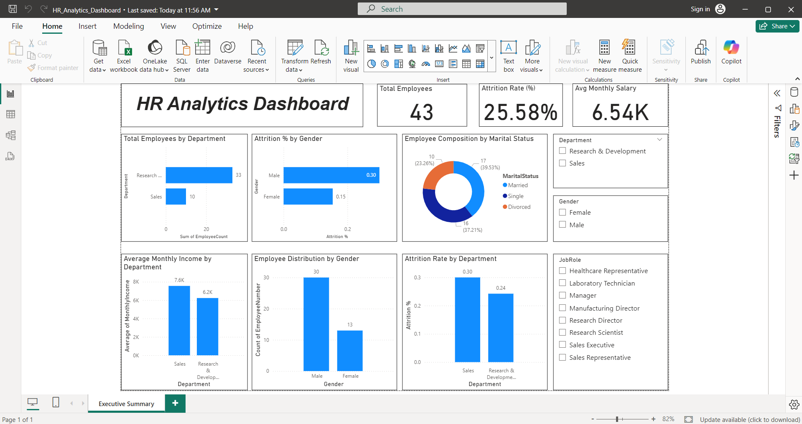

# 👨‍💼 HR Analytics: Employee Performance & Attrition Analysis

## 📌 Project Overview

This project analyzes employee performance and attrition using SQL for data querying and Power BI for interactive dashboard development. The dashboard provides insights into workforce trends, employee demographics, job satisfaction, and factors contributing to employee attrition.

---

## 🎯 Objectives

- Analyze employee attrition trends
- Identify departments with high attrition
- Monitor employee demographics
- Evaluate job satisfaction levels
- Support HR decision-making through data visualization

---

## 🛠️ Tools & Technologies

- SQL
- Power BI
- DAX
- Microsoft Excel (Data Preparation)

---

## 📊 Key Performance Indicators (KPIs)

- Total Employees
- Attrition Count
- Attrition Rate
- Average Age
- Average Salary
- Average Years at Company

---

## 📈 Dashboard Insights

- Department-wise Attrition
- Gender Distribution
- Age Group Analysis
- Education Field Analysis
- Job Role Analysis
- Job Satisfaction
- Monthly Income Distribution

---

## 📂 Repository Structure

```text
HR-Analytics-Employee-Performance-and-Attrition-Analysis/
├── HR Analytics Dashboard.pbix
├── HR Analytics Dataset.csv
├── SQL Queries.sql
├── README.md
└── images/
```

---

## ▶️ How to Use

1. Download the repository.
2. Open the `.pbix` file in Microsoft Power BI Desktop.
3. Refresh the data if required.
4. Explore the interactive dashboard.

---

## 📷 Dashboard Preview

### HR Dashboard



---

## 🧠 Skills Demonstrated

- SQL
- Power BI
- DAX
- Data Cleaning
- Data Modeling
- Dashboard Development
- KPI Reporting
- Business Intelligence
- Data Visualization

---

## 🚀 Business Impact

The dashboard enables HR teams to:

- Identify employee attrition patterns
- Monitor workforce demographics
- Analyze employee satisfaction
- Support data-driven HR decisions
- Improve employee retention strategies

---

## 🔮 Future Enhancements

- Predict employee attrition using Machine Learning
- Add drill-through pages
- Build department-level dashboards
- Add forecasting visuals
- Connect to a live SQL database
